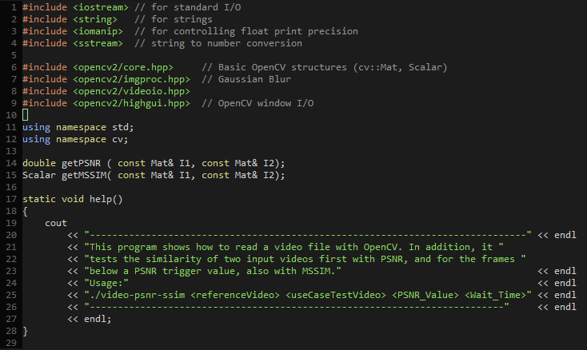

# dotvim
This is my vim config. Nothing too fancy just the shortcuts that I really like and a custom color scheme.

## Installation
Run the following commands:
```
git clone git@github.com:steven-nichols/dotvim.git ~/.vim
ln -s ~/.vim/.vimrc ~/.vimrc
```

## Screenshot

